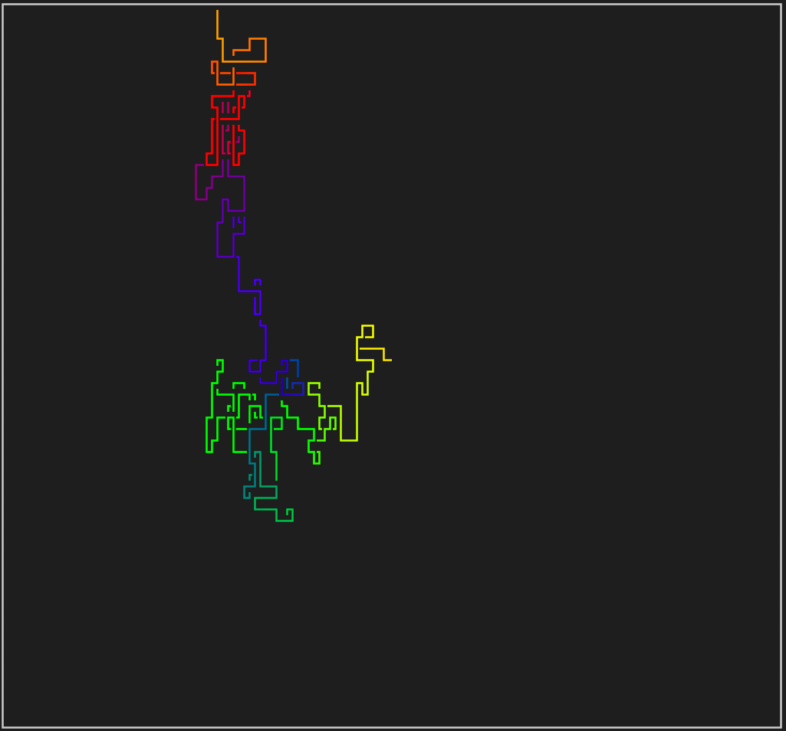

# pipes

2D Pipes in the Terminal just like ye olden Windows Screensavers!
<div align="center">
  
</div>

## Setup
The following prerequisites are required:
- `gcc`
- `make`

Build the binary with `make`.
A debug build can be built with `make debug`.
Project cleanup can be run with `make clean`.

The binary can be found in `bin/`.

## Run
Execute the binary with `./bin/pipes`

### Help Menu
```shell
Usage: ./pipes
Display some pipes just like ye olden Windows Screensavers!

 OPTIONS:
        -c
                Use RGB-256 color mode
        -h
                Print this Help Menu and Exit
```